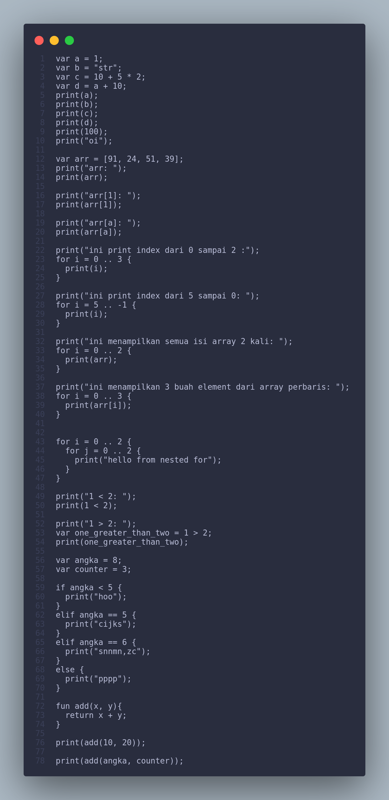
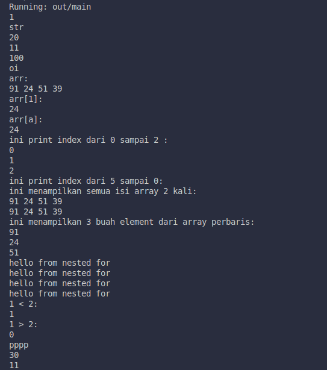

# Lexer - JavaScript

Lexer ini merupakan Lexical Analyzer untuk memecah input string menjadi token-token. Token-token ini digunakan oleh parser untuk analisis lebih lanjut. Kode ini dilengkapi dengan berbagai fungsi untuk memeriksa karakter dalam input dan mengidentifikasi berbagai elemen kode.

# Fitur
Lexer ini memiliki kemampuan untuk memeriksa dan mengenali:
    Angka: Integer dan float.
    String: Teks yang diapit oleh tanda kutip.
    Identifier: Variabel dan nama fungsi.
    Operator: Seperti +, -, *, /, dll.
    Pembanding dan Penugasan: Seperti =, ==, >=, !=, dll.
    Tanda baca: Seperti ;, ,, (), {}, dll.

# Fungsi-fungsi Utama
1. **`next_char()`**<br/>
Fungsi ini memindahkan posisi ke karakter berikutnya dalam input string dan memperbarui currentChar dengan karakter baru di posisi tersebut.
2. **`peek()`**<br/>
Fungsi ini mengembalikan karakter saat ini tanpa mengubah posisi pembaca.
3. **`skip_whitespace()`**<br/>
Fungsi ini akan melewatkan karakter spasi, tab, dan baris baru, dan berpindah ke karakter berikutnya yang bukan spasi.
4. **`isDigit(char)`**<br/>
Fungsi ini memeriksa apakah karakter yang diberikan adalah angka (0-9).
6. **`isAlphaNumeric(char)`**<br/>
Fungsi ini memeriksa apakah karakter yang diberikan adalah huruf (alfabet), angka, atau titik (.). Ini digunakan untuk mendeteksi identifier yang dapat mengandung angka atau titik.
7. **`readNumber()`**<br/>
Fungsi ini membaca dan mengembalikan token untuk angka (baik integer maupun float). Jika menemukan titik (.), maka dianggap sebagai bilangan desimal.
8. **`readString()`**<br/>
Fungsi ini membaca dan mengembalikan token untuk string yang diawali dan diakhiri dengan tanda kutip (baik " atau ').
9. **`readBoolean()`**<br/>
Fungsi ini membaca dan mengembalikan token untuk nilai boolean (true atau false). Fungsi ini memeriksa apakah karakter saat ini adalah t untuk "true" atau f untuk "false", dan jika ditemukan, akan melewati karakter-karakter berikutnya yang membentuk kata tersebut, kemudian mengembalikan token dengan tipe BOOLEAN dan nilai yang sesuai (true atau false).
10. **`readIdentifier()`**<br/>
Fungsi ini membaca dan mengembalikan token untuk identifier (variabel atau fungsi). Fungsi ini juga memeriksa apakah identifier tersebut merupakan salah satu kata kunci (seperti var, print, if, dll.).
11. **`get_next_token()`**<br/>
Fungsi ini mengembalikan token berikutnya berdasarkan karakter input saat ini. Fungsi ini akan terus memindai karakter hingga menemukan token yang valid.
12. **`tokenize()`**<br/>
Fungsi ini akan memproses seluruh input dan mengembalikan array yang berisi semua token yang ditemukan hingga akhir input (EOF).

# Contoh Penggunaan
Berikut adalah contoh cara menggunakan lexer untuk memeriksa kode input var a = 10; dan mengembalikan token yang sesuai.

```js
var x = 10;
```
Maka akan menghasilkan output: <br/>

```js
[
  { type: 'VAR', value: 'var' },
  { type: 'IDENTIFIER', value: 'a' },
  { type: 'ASSIGN', value: '=' },
  { type: 'INT', value: 10 },
  { type: 'SEMICOLON', value: ';' },
  { type: 'EOF', value: null }
]
```


---

# Parser - JavaScript

Parser ini digunakan untuk mengonversi sekumpulan token yang dihasilkan oleh lexer menjadi struktur yang lebih kompleks, yaitu pohon sintaksis abstrak (AST). Parser menggunakan teknik **recursive descent parsing**, yang memungkinkan untuk menangani berbagai ekspresi dan pernyataan dengan lebih mudah dan terstruktur.

# Fitur
Parser ini memiliki kemampuan untuk:<br/>
* Memproses pernyataan dasar seperti deklarasi variabel, print, dan kontrol alur (if-else, for).<br/>
* Menangani ekspresi matematika, perbandingan, dan pemanggilan fungsi.<br/>
* Membuat dan mengelola fungsi, termasuk pengembalian nilai dan parameter.<br/>
* Menghasilkan AST yang mewakili struktur kode secara hierarkis.<br/>

# Fungsi-fungsi Utama
1. **`next_token()`**<br/>
   Fungsi ini digunakan untuk menggeser posisi ke token berikutnya dalam daftar token dan memperbarui token yang sedang diproses.

2. **`match(type, value = null)`**<br/>
   Fungsi ini memeriksa apakah token berikutnya sesuai dengan tipe dan nilai yang diharapkan. Jika cocok, token berikutnya akan dibaca dan diproses.

3. **`expect(type)`**<br/>
   Fungsi ini memastikan bahwa token berikutnya sesuai dengan tipe yang diharapkan. Jika tidak, akan melemparkan error sintaks.

4. **`parse()`**<br/>
   Fungsi utama yang menginisiasi proses parsing dan memulai analisis sintaks pada seluruh input.

5. **`parseStatement()`**<br/>
   Fungsi ini mengidentifikasi dan memproses berbagai jenis pernyataan seperti deklarasi variabel, print, if-else, dan pernyataan lainnya.

6. **`parseVarDeclStmt()`**<br/>
   Fungsi ini menangani parsing pernyataan deklarasi variabel, yang melibatkan pengenalan tipe variabel dan nilai yang diberikan.

7. **`parsePrintStmt()`**<br/>
   Fungsi ini menangani parsing pernyataan print yang mencetak ekspresi atau nilai.

8. **`parseIfStmt()`**<br/>
   Fungsi ini menangani parsing pernyataan if-else, termasuk ekspresi kondisi dan blok pernyataan yang dijalankan berdasarkan kondisi tersebut.

9. **`parseForStmt()`**<br/>
   Fungsi ini menangani parsing pernyataan for loop, yang melibatkan inisialisasi, kondisi, dan langkah-langkah iterasi.

10. **`parseReturnStmt()`**<br/>
    Fungsi ini menangani parsing pernyataan return yang mengembalikan nilai dari sebuah fungsi.

11. **`parseFunctionDeclStmt()`**<br/>
    Fungsi ini menangani parsing deklarasi fungsi, termasuk nama fungsi, parameter, dan isi dari fungsi tersebut.

12. **`parseFunctionCall()`**<br/>
    Fungsi ini menangani parsing pemanggilan fungsi dengan mengidentifikasi nama fungsi dan argumen yang diberikan.

13. **`parseBlock()`**<br/>
    Fungsi ini menangani parsing blok kode, yaitu kumpulan pernyataan yang dikelilingi oleh tanda kurung kurawal `{}`.

14. **`parseExpressionUntil()`**<br/>
    Fungsi ini membaca ekspresi hingga menemukan token yang tidak dapat diterima dalam ekspresi, seperti tanda kurung tutup atau pernyataan akhir.

15. **`parseExpression()`**<br/>
    Fungsi ini mengonversi token ekspresi menjadi struktur pohon sintaksis yang sesuai dengan aturan bahasa.

16. **`parseEquality()`**<br/>
    Fungsi ini menangani ekspresi perbandingan seperti `==` dan `!=`.

17. **`parseComparison()`**<br/>
    Fungsi ini menangani ekspresi perbandingan seperti `>`, `<`, `>=`, `<=`.

18. **`parseTerm()`**<br/>
    Fungsi ini menangani ekspresi aritmatika untuk operasi penjumlahan dan pengurangan.

19. **`parseFactor()`**<br/>
    Fungsi ini menangani ekspresi aritmatika untuk operasi perkalian dan pembagian.

20. **`parsePrimary()`**<br/>
    Fungsi ini menangani ekspresi primer, seperti angka, string, atau identifier.

# Contoh Penggunaan
Berikut adalah contoh cara menggunakan parser untuk memproses kode input dan menghasilkan AST.<br/>

```js
var x = 10;
if (x > 5) {
  print(x);
}
```

Hasil AST yang dihasilkan:

```js
ProgramStmt {
  type: 'Program',
  statements: [
    VarDeclStmt {
      type: 'VarDecl',
      name: 'x',
      initializer: LiteralStmt { type: 'Literal', value: 10 }
    },
    IfStmt {
      type: 'If',
      condition: BinaryOpStmt {
        type: 'BinaryOp',
        left: IdentifierStmt { type: 'Identifier', name: 'x' },
        op: '>',
        right: LiteralStmt { type: 'Literal', value: 5 }
      },
      then_block: [
        PrintStmt {
          type: 'Print',
          expression: IdentifierStmt { type: 'Identifier', name: 'x' }
        }
      ],
      elifs: [],
      else_block: null
    }
  ]
}
```

---
# Compiler - JavaScript
Compiler ini bertanggung jawab untuk mengonversi Abstract Syntax Tree (AST) dari kode sumber menjadi kode assembler, serta menangani berbagai jenis pernyataan dan ekspresi dalam kode tersebut. Kode ini mendemonstrasikan cara-cara menangani deklarasi variabel, kontrol alur (seperti `if` dan `for`), serta fungsi (seperti deklarasi fungsi dan pernyataan `return`).

# Fitur
Compiler ini memiliki kemampuan untuk menangani:<br/>
* Deklarasi variabel (termasuk literal dan array).<br/>
* Ekspresi aritmatika dan logika (seperti penambahan, pengurangan, perbandingan, dll.).<br/>
* Pernyataan kontrol seperti `if` dan `for`.<br/>
* Deklarasi dan pemanggilan fungsi.<br/>
* Pencetakan hasil ekspresi (seperti nilai variabel atau hasil perhitungan).<br/>

# Fungsi-fungsi Utama
1. **`generateVarDecl(obj)`**<br/>
   Fungsi ini menangani deklarasi variabel. Berdasarkan jenis nilai awalnya (seperti literal, array, atau ekspresi aritmatika), kode ini akan menghasilkan kode assembler yang sesuai. Misalnya, jika variabel diinisialisasi dengan angka, kode assembler yang dihasilkan akan menggunakan direktif `dd` untuk mendeklarasikan variabel dalam segmen `.data`.

2. **`generateOperand(operand)`**<br/>
   Fungsi ini menangani operand yang digunakan dalam operasi aritmatika atau logika. Operand bisa berupa literal, identifier (variabel), atau ekspresi biner. Fungsi ini menghasilkan kode untuk memuat operand ke dalam register `eax`.

3. **`generateBinaryOp(expr)`**<br/>
   Fungsi ini menangani ekspresi biner (seperti penambahan atau perbandingan). Berdasarkan operator yang digunakan, kode ini menghasilkan instruksi assembler untuk melakukan operasi matematika atau perbandingan yang sesuai. Kode ini juga menggunakan register `eax` dan `ecx` untuk menyimpan operand dan hasil operasi.

4. **`generatePrint(obj)`**<br/>
   Fungsi ini menangani perintah `print`. Bergantung pada jenis ekspresi yang diberikan (seperti identifier, literal, atau ekspresi biner), fungsi ini menghasilkan instruksi untuk memanggil prosedur pencetakan. Jika ekspresinya adalah ekspresi biner, hasil operasi terlebih dahulu dihitung dan kemudian dicetak.

5. **`generateStatement(statement)`**<br/>
   Fungsi ini menerima sebuah pernyataan dan memanggil generator yang sesuai berdasarkan jenis pernyataan (seperti `VarDecl`, `Print`, `If`, `For`, dll.). Generator yang digunakan akan mengonversi pernyataan tersebut menjadi kode assembler.

6. **`generate()`**<br/>
   Fungsi utama yang menjalankan proses kompilasi. Fungsi ini mengiterasi seluruh pernyataan dalam AST dan memanggil fungsi `generateStatement()` untuk masing-masing pernyataan. Hasil akhirnya adalah kode assembler yang mencakup bagian data, bagian BSS, dan bagian teks yang diperlukan untuk menjalankan program.

# Struktur Data
* **AST Tree**: Merupakan pohon sintaksis abstrak yang diterima oleh compiler, yang berisi berbagai pernyataan dan ekspresi.<br/>
* **Sections**: Compiler ini menggunakan tiga bagian utama dalam kode assembler yang dihasilkan:<br/>
    <ul>
        <li><b>.data</b> untuk menyimpan data seperti variabel dan string.</li>
        <li><b>.bss</b> untuk variabel yang belum diinisialisasi.</li>
        <li><b>.text</b> untuk kode eksekusi yang mencakup instruksi.</li>
    </ul>

# Contoh Penggunaan
Berikut adalah contoh cara compiler ini menangani kode sumber yang menggunakan deklarasi variabel, operasi aritmatika, dan perintah `print`.
Misalnya, kode sumber berikut:

```js
var a = 10;
var b = 5;
var c = a + b;
print(c);
```

Compiler akan menghasilkan kode assembler yang mirip dengan ini:

```asm
section .data
    a dd 10
    b dd 5
    c dd 0

section .text
    mov eax, [a]
    add eax, [b]
    mov [c], eax
    push eax
    call print_int
    add esp, 4
    call newline
```

Dalam kode di atas:<br/>
* Variabel `a`, `b`, dan `c` dideklarasikan di bagian `.data`.<br/>
* Operasi penambahan dilakukan dan hasilnya disimpan dalam `c`.<br/>
* Hasil nilai `c` dicetak menggunakan prosedur `print_int`.<br/>
Compiler ini mengonversi setiap pernyataan dalam AST menjadi kode assembler yang dapat dieksekusi pada tingkat mesin.

---
# Screenshoot Contoh Program


# Screenshot Hasil Program


---
# Penutup
Untuk versi awal ini, beginilah compiler yang bisa saya buat, saya menyadari masih banyak kekurangan mulai dari kurangnya fungsi lain yang bisa disediakan, kurangnya fitur fitur manipulasi karena baru ada fitur deklarasi dan print, serta implementasi dalam assembly yang kurang rapi karena belum menerapkan fitur variabel local dalam stack dan alokasi dinamis dalam heap.